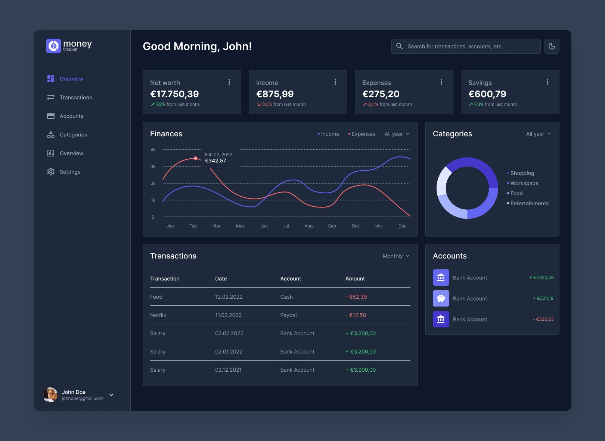

  
  

  

    Take control of your finances with MoneyTracker
     
    <a href="#">View Demo</a>
    ·
    <a href="#">Report Bug</a>
    ·
    <a href="#">Request Feature</a>
  

MoneyTracker is a web-based application that allows users to track their income and expenses to gain insight into their financial situation. By tracking all financial transactions, users can better understand their spending habits and make informed decisions about their money.

:construction: Please note that MoneyTracker is a personal project and is still under development.

## Table of contents
- [Features](#features)
- [Installing MoneyTracker](#installing-moneytracker)
  - [Prerequisites](#prerequisites)
  - [Installation](#installation)
- [Technologies used](#technologies-used)
- [License](#license)

## Features
Features will be listed here soon.

## Installing MoneyTracker
More information is on the way.

### Prerequisites
There are no prerequisites yet.

### Installation
There is currently no guide for installation.

## Technologies used
- [React](https://reactjs.org/)
- [Node.js](https://nodejs.org/)
- [Express.js](https://expressjs.com/)
- [MongoDB](https://www.mongodb.com/)
- [TypeScript](https://www.typescriptlang.org/)
- [Vite](https://vitejs.dev/)
- [Cypress](https://www.cypress.io/)
- [Docker](https://www.docker.com/)
- [GitHub Actions](https://github.com/features/actions)

## License
MoneyTracker is licensed under the MIT license.
